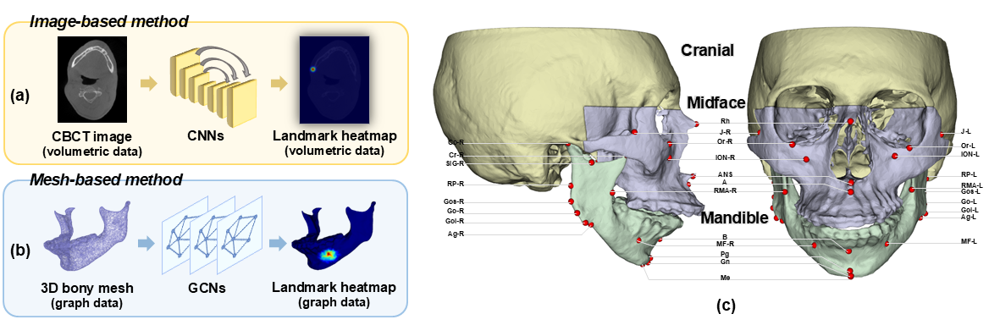
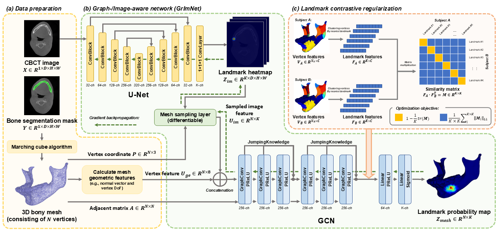

# GrImNet
ISBI 2025 - Cephalometric Landmark Detection using Graph- and Image-aware Network with Landmark Contrastive Regularization

## Citation
  *X. Xu, T. Kuang, A. Chen, N. Lampen, J. Lee, X. Fang, D. Kim, H.H. Deng, J. Gateno, and P. Yan. “Cephalometric Landmark Detection using Graph- and Image-aware Network with Landmark Contrastive Regularization,” in 2025 IEEE International Symposium on Biomedical Imaging (ISBI 2025). Houston, TX, USA, Apr. 14-17, 2025. (accepted)*

    @inproceedings{Xu2025GrImNet, 
      title={Cephalometric Landmark Detection using Graph- and Image-aware Network with Landmark Contrastive Regularization},
      author={Xuanang Xu and Tianshu Kuang and Anwei Chen and Nathan Lampen and Jungwook Lee and Xi Fang and Daeseung Kim and Hannah H. Deng and Jaime Gateno and Pingkun Yan},
      booktitle={2025 IEEE International Symposium on Biomedical Imaging},
      year={2025},
    }

## Abstract
The detection or digitization of cephalometric landmarks is a critical step in the clinical pipeline of craniomaxillofacial (CMF) surgical planning. Prior methods for cephalometric landmark detection are limited to using either CBCT images or 3D bony meshes to infer the landmark positions and thus result in suboptimal outcomes. In this study, we propose to use both CBCT images and 3D bony models (derived from CBCT images) to detect landmarks, which allows for comprehensive consideration of both imaging and geometric information for more accurate and robust landmark detection. To overcome the challenge of effectively utilizing the two heterogeneous modalities, we designed a novel CNN-GCN hybrid network, Graph-/Image-aware Network (GrImNet), which enables end-to-end training and inference using grid image and non-grid mesh data for cephalometric landmark detection. Additionally, we proposed a landmark graph contrastive regularization strategy to regularize the training of GrImNet, which further enhances the discriminability of learned landmark features. We conducted extensive experiments on a clinical dataset, and the results show that our proposed method outperforms other competing methods by significant margins, demonstrating the effectiveness of our designs. Source code is publicly
available at [https://github.com/RPIDIAL/GrImNet](https://github.com/RPIDIAL/GrImNet).

### Cephalometric landmark detection

## Method
### Scheme of GrImNet

## Contact
You are welcome to contact us:  
  - [xux12@rpi.edu](mailto:xux12@rpi.edu) ([Dr. Xuanang Xu](https://superxuang.github.io/))
